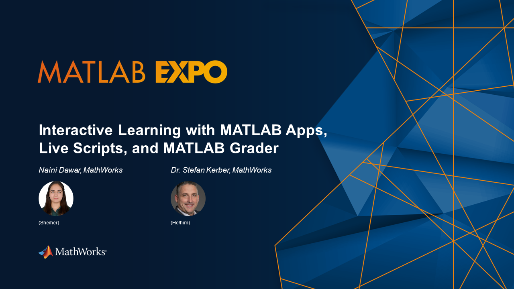

# [MATLAB EXPO 2023: Interactive Learning with MATLAB Apps, Live Scripts, and MATLAB Grader](https://www.matlabexpo.com/)

**Workshop Description:**  
This workshop develops a lab experiment to learn about the prime [MATLAB®](https://www.mathworks.com/products/matlab.html) applications for research and teaching. It will be conducted using the [Canvas&reg;  Learning Management System (Canvas LMS)](https://mathworks.instructure.com/courses/265) and [MATLAB Online](https://www.mathworks.com/products/matlab-online.html).

**Attendees will learn how to:**
* Use the MATLAB App Designer to create a simple application to generate data and execute a Stroop test that allows experimenters to easily collect data from participants who rate the color of printed words.
* Design Live Scripts to interactively illustrate and evaluate the generated data. Visualizations produced by the app will analyze participant responses and reaction times and introduce participants to more advanced analysis techniques (such as machine learning).
* Exchange data between the app and Live Scripts in CSV format to foster exchange and accessibility in commonly used tools like Microsoft&reg; Excel—a popular tool in many disciplines.
* Demonstrate how to develop parts of the application code in [MATLAB Grader™](https://grader.mathworks.com/) and perform automated assessment in case the application is gradually built over the course of a lecture.

The workshop is intended for an audience with basic MATLAB programming skills. Participants are strongly encouraged to complete the [MATLAB Onramp Self-Paced Training](https://matlabacademy.mathworks.com/details/matlab-onramp/gettingstarted) prior to this workshop.

**Agenda:**
* Welcome and Introductions (5 minutes)
* Orientation to the LMS-based Workshop (5 minutes)
* Topic 1: Design a MATLAB App (30 minutes)
* Topic 2: Assess Learner Knowledge (20 minutes)
* Topic 3: Evaluate data with Live-Scripts (20 minutes)
* Wrap-up and additional resources (10 minutes)

**Speakers:**  
Naini Dawar, Customer Success Engineer, MathWorks  
Stefan Kerber, Customer Success Engineer, MathWorks

Copyright 2023 The MathWorks, Inc.
